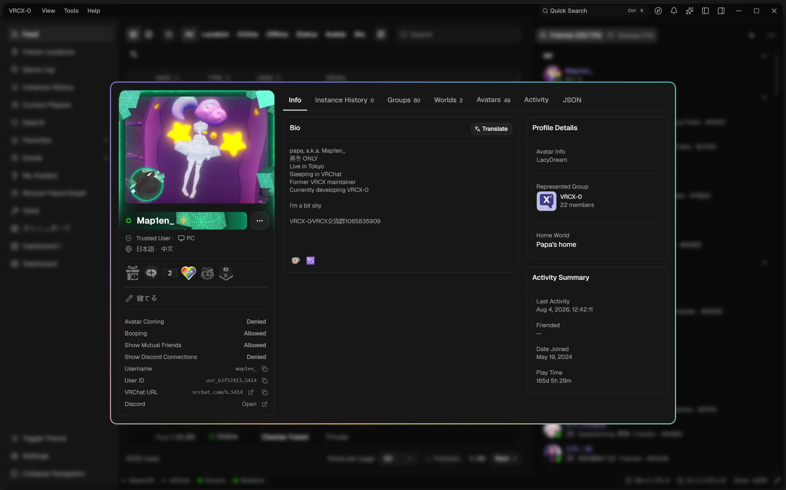

<div align="center">

#  VRCX-0

### 더 빠르고, 더 가벼운 VRCX.

[English](README.md) | [简体中文](README.zh-CN.md) | [繁體中文](README.zh-Hant.md) | [日本語](README.ja-JP.md) | 한국어

[](https://github.com/Map1en/VRCX-0/releases/latest)
[](https://github.com/Map1en/VRCX-0/releases)
[](https://github.com/Map1en/VRCX-0/releases/latest)
[](https://discord.gg/fehKP3SVPN)
<br>
[](https://github.com/Map1en/VRCX-0/actions/workflows/ci.yml)
[](https://github.com/Map1en/VRCX-0/actions/workflows/ci.yml)
[](LICENSE)
[](https://app.fossa.com/projects/git%2Bgithub.com%2FMap1en%2FVRCX-0?ref=badge_shield)

[](https://github.com/Map1en/VRCX-0/releases/latest)

Windows · macOS · Linux



</div>

VRCX-0는 VRCX의 이전 유지보수 담당자 중 한 명이 처음부터 다시 만든 버전으로, 네이티브 Rust 코어(Tauri + React) 위에 재작성되었습니다. 재작성의 효과가 가장 잘 드러나는 부분은 성능입니다. 몇 년치 기록이 쌓여도 여전히 가볍게 동작하며, 메모리 사용량과 설치 용량 모두 기존 VRCX보다 크게 낮습니다.

첫 실행 시 기존 VRCX 데이터와 설정을 자동으로 가져오며, 원본 데이터는 수정되지 않아 언제든 되돌아갈 수 있습니다.

원본 VRCX가 유지보수 중심으로 전환된 이후, 새로운 기능 개발은 VRCX-0에서 이어집니다.

## 설치

[최신 릴리스](https://github.com/Map1en/VRCX-0/releases/latest)에서 사용 중인 플랫폼에 맞는 파일을 받으세요:

| 플랫폼                | 파일                                     |
| --------------------- | ---------------------------------------- |
| Windows               | `VRCX-0_<버전>_windows_x86_64_setup.exe` |
| macOS (Apple Silicon) | `VRCX-0_<버전>_macos_aarch64.dmg`        |
| macOS (Intel)         | `VRCX-0_<버전>_macos_x86_64.dmg`         |
| Linux                 | `.AppImage`, `.deb`, `.rpm`              |

한 번만 받으면 됩니다 — 이후에는 VRCX-0가 알아서 업데이트합니다.

## 주요 특징

- **몇 년치 기록에도 느려지지 않음** — VRCX가 눈에 띄게 느려지는 데이터양도 VRCX-0에서는 여전히 쾌적하게 동작하며, 저사양 PC나 NAS급 미니 PC에서도 무리 없이 실행됩니다
- **VRCX 대비 메모리 사용량 약 50%–70% 절감** — **백그라운드 모드**를 켜면 수십 MB까지 내려가고, 모든 핵심 기능은 그대로 동작합니다
- **아바타 하나보다 작은 용량** — 설치 파일 10MB대, 설치 후 30MB대로 VRCX보다 10배 이상 작습니다
- **부담 없는 마이그레이션** — VRCX 데이터베이스와 설정을 자동으로 가져오며, 원본 데이터는 절대 수정되지 않습니다

그 밖의 기능:

- **소셜 AI** — VRChat 사교 생활을 이해하도록 돕는 내장 어시스턴트입니다. 가장 자주 함께 노는 사람, 점점 멀어지는 사람, 친구를 만나기 좋은 시간대 등을 물어볼 수 있습니다. 직접 준비한 OpenAI 호환 엔드포인트로 동작하며 로컬 LLM도 지원
- **MCP 서버** — 내 컴퓨터에서만 실행되고 토큰으로 보호되는 서버를 통해 로컬 VRCX-0 소셜 데이터를 MCP 호환 AI 클라이언트(Claude 등)에 공개하여, 이미 사용하는 도구에서 바로 활용할 수 있습니다
- **계정별 로컬 기록** — 게임 로그 등 계정별 기록은 현재 로그인한 계정에 따로 저장되므로, 여러 계정을 사용해도 새 기록이 서로 섞이지 않습니다. 업그레이드 후에도 기존 기록은 그대로 확인할 수 있습니다
- **백업 및 복원** — 클릭 한 번으로 데이터를 하나의 압축 백업 파일로 만들 수 있습니다. 정기 백업을 설정하면 이전 백업도 여러 세대 자동으로 보관되며, 필요할 때 언제든 백업에서 복원할 수 있습니다
- **월드 컬렉션 공유** — 즐겨찾기한 월드를 공유 가능한 컬렉션 페이지로 만들 수 있습니다. 링크를 받은 사람은 브라우저에서 컬렉션을 둘러보고, VRChat 공식 사이트에서 개별 월드를 열거나, 컬렉션을 VRCX-0으로 가져올 수 있습니다. 월드나 아바타 하나만 공유할 수 있는 VRCX-0 공유 링크도 만들 수 있습니다
- **소셜 자동화** — 시간대·인스턴스 유형·함께 있는 사람에 따라 상태와 소개글을 자동 변경; 초대 요청 자동 수락; 규칙 종료 시 이전 상태로 자동 복원
- **가벼운 VR 손목 Overlay**, 성능 영향 최소; OpenVR (SteamVR)과 **OpenXR (Linux / WiVRn / Monado)** 모두 지원
- **커뮤니티 테마** — 카탈로그에서 테마를 찾아 설치하고, 커스텀 배경 이미지를 설정하거나 원하는 CSS를 직접 추가
- **4채널 알림 전달** — 데스크톱 알림, 텍스트 음성 변환(TTS), VR Overlay 알림, Webhook을 이벤트 유형별로 각각 독립 설정
- **Webhook 알림** — 임의의 Webhook URL로 이벤트를 전달하며, Discord 호환 페이로드를 지원하고 전송할 필드를 정확히 선택할 수 있습니다
- 앱 전체에서 완전한 키보드 내비게이션 지원
- 고급 사용자를 위한 헤드리스 모드 제공 — `crates/headless` 참고

## 데이터 마이그레이션

첫 실행 시 기존 VRCX 데이터베이스와 설정을 자동으로 가져올 수 있습니다. 원본 데이터는 수정되지 않으며, 기존 사용자는 별도 설정 없이 바로 이어서 사용할 수 있습니다.

나중에 데이터 폴더를 옮겨야 할 때도 새 위치만 선택하면 데이터가 자동으로 이전됩니다.

## 라이선스

이 저장소의 초기 커밋은 포크 시점의 업스트림 VRCX 스냅샷에 해당하며 MIT 라이선스가 적용됩니다.

포크 이후에 추가, 수정, 재작성된 모든 코드에는 GNU General Public License v3.0 (GPLv3) 라이선스가 적용됩니다.

[](https://app.fossa.com/projects/git%2Bgithub.com%2FMap1en%2FVRCX-0?ref=badge_large)

## 소스에서 빌드

개발에 참여할 때만 필요합니다 — [CONTRIBUTING.md](CONTRIBUTING.md)를 참고하세요.

필요 사항: Node.js ≥ 24.10, npm ≥ 11.5, rustup을 통해 설치한 안정 버전 Rust 툴체인.
Windows에서는 **Visual Studio Build Tools**를 설치하고 **"C++를 사용한 데스크톱 개발"** 워크로드를 선택해야 합니다.

```bash
git clone https://github.com/Map1en/VRCX-0
cd VRCX-0

npm install
npm run tauri:dev
```
